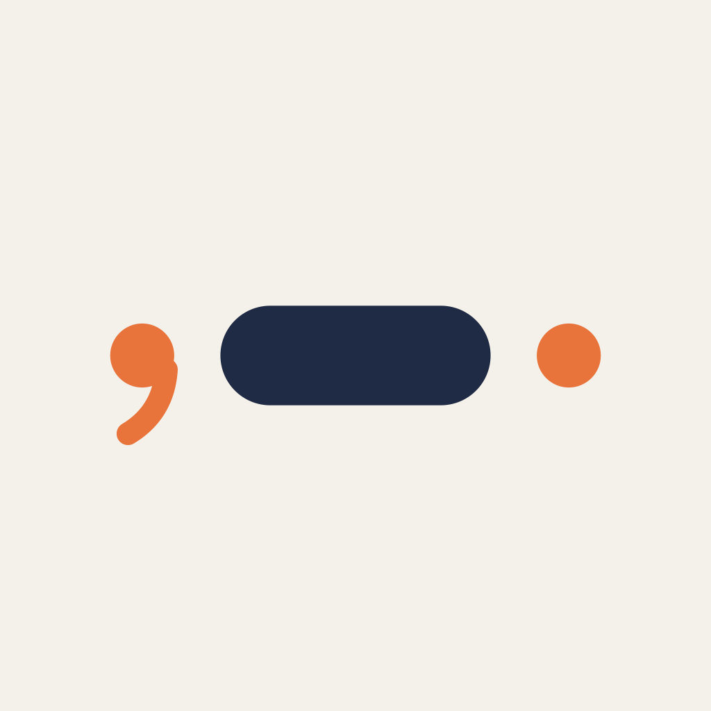
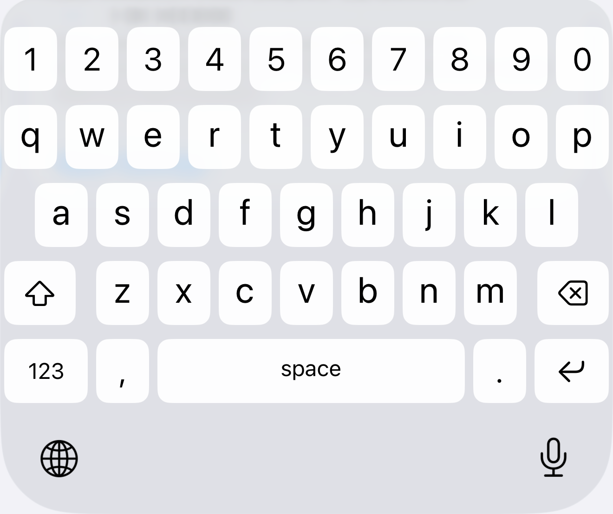
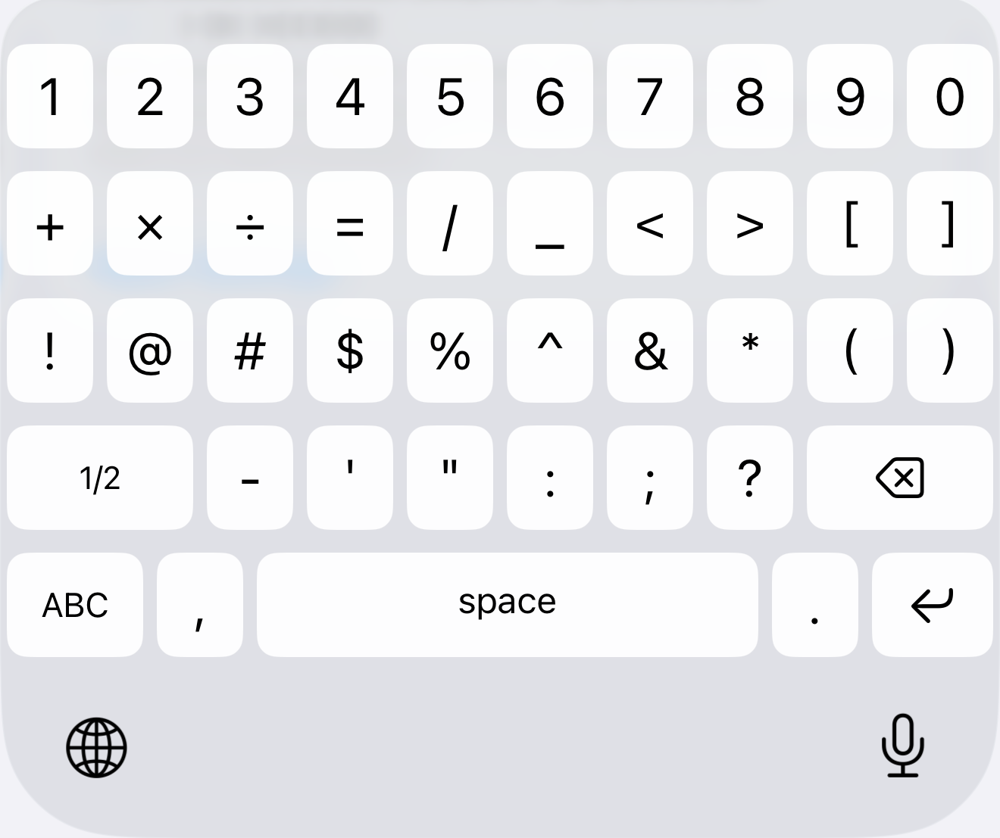
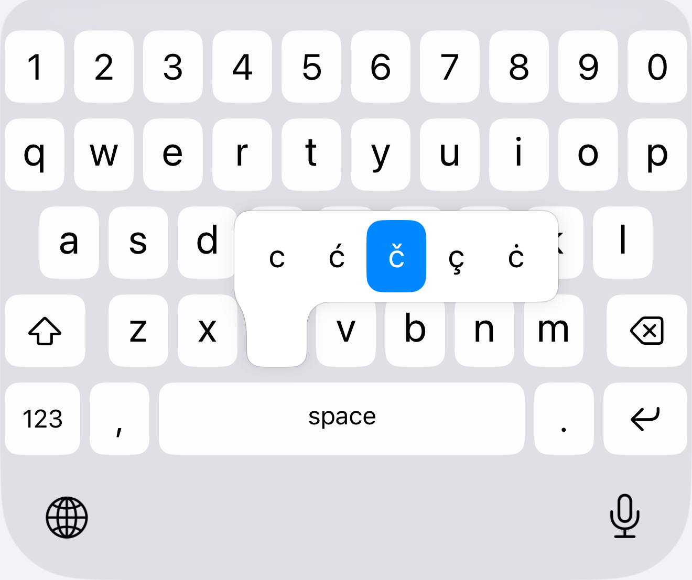

# Simple Keyboard

A custom iOS keyboard extension: the stock QWERTY layout with a digits row,
`,` and `.` flanking the spacebar, a narrower return key and no suggestion bar.
Tapping 123 opens two Android-style symbol pages, and long-pressing `.`, S, C, D
or Z offers punctuation and the Serbian letters š, ć, č, đ and ž.

Built on [KeyboardKit](https://github.com/KeyboardKit/KeyboardKit) 10.9.5.

## Screenshots

<table>
  <tr>
    <td></td>
    <td></td>
    <td></td>
  </tr>
  <tr>
    <td align="center">Letters</td>
    <td align="center">Symbols</td>
    <td align="center">Long-press</td>
  </tr>
</table>

Full-screen versions sized for App Store Connect are in
[`screenshots/app-store`](screenshots/app-store).

## Requirements

- Xcode 26+ (iOS 26 SDK)
- [XcodeGen](https://github.com/yonaskolb/XcodeGen) — the `.xcodeproj` is generated, not committed

## Build

```sh
brew install xcodegen
xcodegen generate
xcodebuild -project SimpleKeyboard.xcodeproj -scheme SimpleKeyboard \
  -destination 'platform=iOS Simulator,name=iPhone 17' build
```

## Enabling the keyboard

Settings → General → Keyboard → Keyboards → Add New Keyboard… → Simple Keyboard,
then hold the 🌐 globe key while typing and pick it.

## Layout

The layouts live in `Keyboard/KeyboardLayout+MyLayout.swift`:

- the digits row is a real layout row inserted at index 0
- `,` and `.` are inserted before/after `.space`
- the return key is resized by matching the `.primary` action case, because its
  associated `ReturnKeyType` varies per text field
- the numeric and symbolic pages are built from `SymbolPage`, one string per row

The long-press popups are in `Keyboard/CustomKeyboardView.swift`: `periodCallouts`
for `.`, and `letterCallouts` for the letters, which go ahead of KeyboardKit's
standard accents.

KeyboardKit's built-in input toolbar (`keyboardInputToolbarDisplayMode(.numbers)`)
renders blank on iPhone in the free tier, which is why the digits row is built by hand.

## Structure

| Path | Purpose |
|---|---|
| `project.yml` | XcodeGen spec — source of truth for both targets |
| `App/` | Container app (required to ship the extension) |
| `Keyboard/` | The keyboard extension |
| `Shared/` | Config shared by both targets |
| `screenshots/` | App Store screens and keyboard-only crops |

## Notes

- KeyboardKit v10 is **closed source** (free tier + paid Pro), distributed as a
  binary `.xcframework`. It is linked to the app target only; the extension
  resolves it at runtime from the app's `Frameworks/` folder.
- `RequestsOpenAccess` is `false`, so the keyboard works without Full Access.
  No haptics and no App Group sync until that changes.
- Autocorrect, predictive text and the emoji keyboard are KeyboardKit Pro features
  and are not present.
